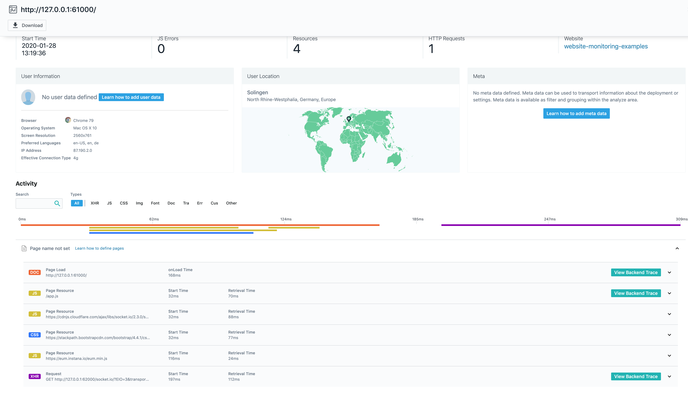

# XHR / Fetch Cross-Origin Backend Correlation Example

This example shows how to achieve backend correlation for the `XMLHttpRequest` and
`fetch` APIs when making cross-origin requests. Furthermore is showcases what to
do when leveraging socket.io.

In this example we have two involved servers:

 - An API server that exposes an API and socket.io endpoints on port `62000`.
 - An app server that serves static files on port `61000`.

The browser will load the files from the app server upon startup and then communicate
with the API server. This communication crosses into a separate origin.



## How To Try This Example?

### Cloning the repository

```
git clone https://github.com/instana/website-monitoring-examples.git
```

### Starting the API Server

```
cd website-monitoring-examples/examples/xhr-backend-correlation/node-js-express-js-socket-io/api
npm install
npm start
```

### Starting the App Server

```
cd website-monitoring-examples/examples/xhr-backend-correlation/node-js-express-js-socket-io/api
npm install
npm start
```

### Opening the Demo App in the Web Browser

Go to [http://127.0.0.1:6100](http://127.0.0.1:6100).

## Where Are The Important Parts?

 - The Node.js processes are using the [Instana Node.js collector](https://docs.instana.io/ecosystem/node-js/).
 - The website monitoring snippet is added to `app/assets/index.html`.
 - The origin of the API server is whitelisted in the website monitoring snippet in `app/assets/index.html`.
 - The API server allows CORS requests for requests passing through the socket.io and the express.js pipeline via two usages of the CORS middleware.

## TLDR

### Create and configure the CORS middleware

```javascript
const cors = require("cors");
const corsMiddleware = cors({
  // This allows requests from all origins and might be potentially dangerous.
  // Refer to documentation of the CORS middleware to learn how to restrict
  // access to a subset of origins.
  // https://github.com/expressjs/cors#configuring-cors-w-dynamic-origin
  origin: true,
  credentials: true,
  preflightContinue: false
});
```

### Hook the CORS middleware into the socket.io request processing pipeline

```javascript
const io = require("socket.io")(http, {
  // Enable CORS support for socket.io
  handlePreflightRequest: (req, res) => corsMiddleware(req, res)
});
```

### Hook the CORS middleware into the express.js request processing pipeline

```javascript
// Enable CORS support for regular HTTP calls
app.use("*", corsMiddleware);
```

### Whitelist the origin of the API server for backend correlation

```javascript
ineum('whitelistedOrigins', [/^http:\/\/127\.0\.0\.1:6200.*/i]);
```

### Disable tracking of socket.io XMLHttpRequest and fetch calls

```javascript
// You can choose to disable capturing for socket.io calls. This is recommended as the
// frequency of calls vs. value of capturing of long-polling data is highly questionable.
// Furthermore tracing data is only collected for the long-polling data transmission strategy.
// WebSocket communication is not traced.
ineum('ignoreUrls', [/.*\/socket\.io\/.*/]);
```
